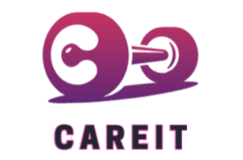
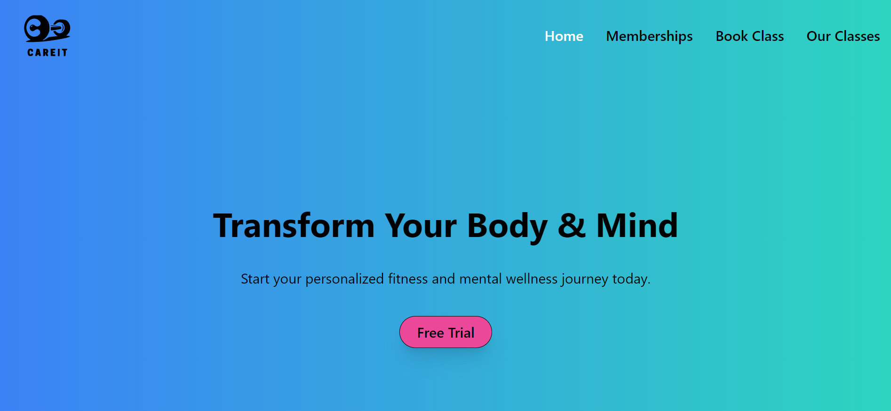
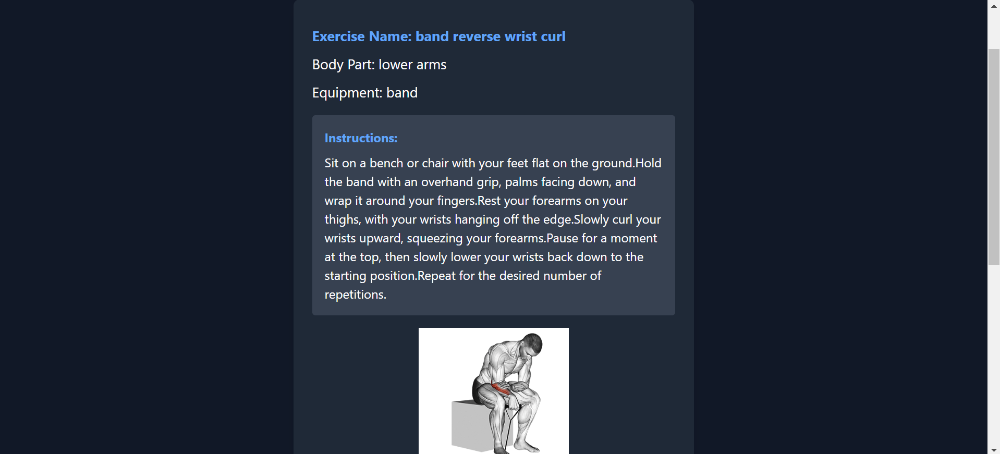
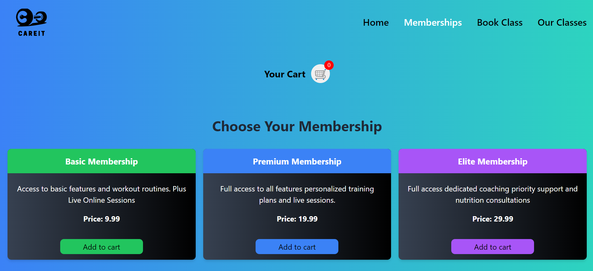
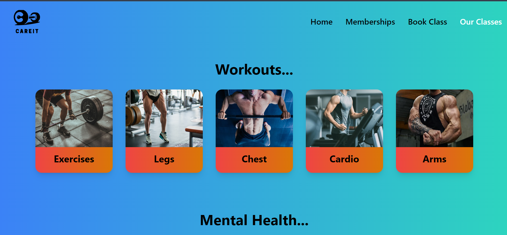

  

<h1 align="center">CareIt!</h1>
<h3 align="center">Empowering Health, Redefining Care.💪🩺</h3>

Your ultimate destination for all your healthcare needs! 💊 Built with React.js, CareIt is a revolutionary web application designed to streamline your healthcare experience. Whether you're browsing for medical supplies, scheduling appointments, or seeking expert advice, CareIt has got you covered.

## 🌟 Features

  

### API Integration
- 🔄 Seamless integration with external APIs ensures real-time access to a vast array of healthcare products and services.
- 🛒 Effortlessly fetch data from reputable sources to provide users with accurate and up-to-date information.

  

### Intuitive Cart Management
- 🛍 Simplify the shopping experience with a user-friendly cart system.
- ➕ Add products to the cart with ease and manage items effortlessly.

  

### Responsive Design
- 📱 CareIt is crafted with a responsive design, ensuring optimal performance across devices.
- 💻 Whether you're on your desktop, tablet, or smartphone, enjoy a seamless user experience.

### Workout Plans Classes
- 💪 Access various workout plans and classes tailored to your fitness goals.
- 🏋️‍♂️ Explore a range of exercise routines designed by fitness experts to help you stay in shape.

  

## 🚀 Get Started

Get started with CareIt today and embark on a journey towards better health and well-being! 🌟
